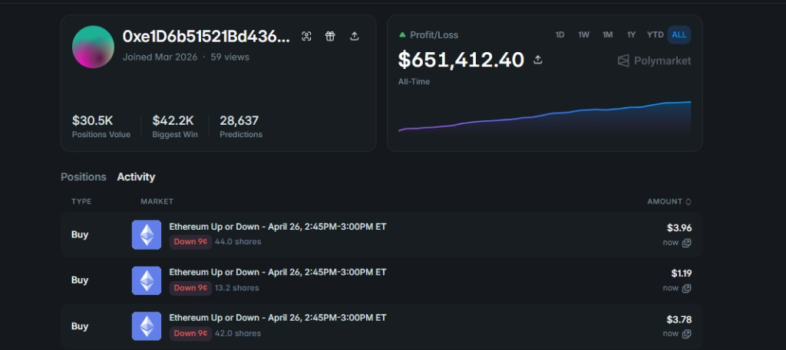
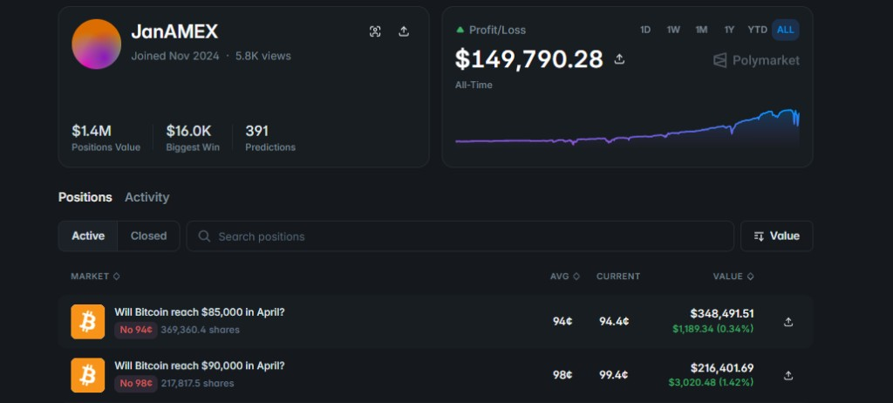
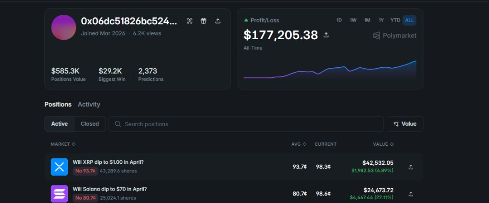

<div align="center">

# Polymarket Copybot

**A professional, GUI-driven copy-trading bot for [Polymarket](https://polymarket.com) — safe by default, live when you're ready.**

[](https://www.python.org/)
[](https://www.riverbankcomputing.com/software/pyqt/)
[](LICENSE)
[](.env)

<br/>


> *Live dashboard — positions, activity log, risk controls and real-time trade feed.*

</div>

---

## Table of Contents

- [Copy Target](#copy-target)
- [Overview](#overview)
- [Features](#features)
- [Architecture](#architecture)
- [Prerequisites](#prerequisites)
- [Installation](#installation)
- [Configuration](#configuration)
- [Usage](#usage)
- [Project Structure](#project-structure)
- [Safety Notes](#safety-notes)
- [Extending the Bot](#extending-the-bot)
- [Contributing](#contributing)

---

## Copy Targets

This bot is pre-configured to track high-performing Polymarket wallets. Two proven targets are documented below — swap between them by updating `LEADER_WALLET` in your `.env`.

---

### Target 1 — `0xe1D6b51521Bd4365...`

**$650K+ all-time profit** across 28,000+ predictions since March 2026, specialising in short-duration crypto direction markets.

<div align="center">

[](https://polymarket.com/0xe1d6b51521bd4365769199f392f9818661bd907c?tab=activity)

**[View live profile →](https://polymarket.com/0xe1d6b51521bd4365769199f392f9818661bd907c?tab=activity)**

</div>

| Stat | Value |
|---|---|
| **Wallet** | [`0xe1D6b51521Bd4365769199f392F9818661BD907`](https://polymarket.com/0xe1d6b51521bd4365769199f392f9818661bd907c?tab=activity) |
| **All-Time P&L** | $650,359+ |
| **Positions Value** | $30.1K |
| **Biggest Win** | $42.2K |
| **Total Predictions** | 28,666+ |
| **Active Since** | March 2026 |
| **Strategy** | High-frequency short-duration crypto direction trades (BTC / ETH / SOL / XRP Up or Down) |

```env
LEADER_WALLET=0xe1d6b51521bd4365769199f392f9818661bd907c
```

---

### Target 2 — JanAMEX

**$149K+ all-time profit** with $1.4M in active positions across 391 predictions since November 2024, focusing on large-scale binary Bitcoin price targets.

<div align="center">

[](https://polymarket.com/@janamex?tab=positions)

**[View live profile →](https://polymarket.com/@janamex?tab=positions)**

</div>

| Stat | Value |
|---|---|
| **Handle** | [@JanAMEX](https://polymarket.com/@janamex?tab=positions) |
| **All-Time P&L** | $149,790+ |
| **Positions Value** | $1.4M |
| **Biggest Win** | $16.0K |
| **Total Predictions** | 391 |
| **Active Since** | November 2024 |
| **Strategy** | Large-position binary Bitcoin price-level markets (e.g. "Will BTC reach $85K / $90K?") |

```env
LEADER_WALLET=janamex   # replace with the resolved wallet address
```

> To find JanAMEX's underlying wallet address, open their profile on Polymarket, copy the wallet shown in the URL or Activity tab, and set it as `LEADER_WALLET`.

---

### Target 3 — `0x06dc51826bc524...`

**$177K+ all-time profit** across 2,373 predictions since March 2026, holding $585K in active positions. Specialises in large "dip to price-level" binary markets on XRP, SOL, and other crypto assets.

<div align="center">

[](https://polymarket.com/@0x06dc51826bc524d9a83770e7de9dd7e005b0452?tab=positions)

**[View live profile →](https://polymarket.com/@0x06dc51826bc524d9a83770e7de9dd7e005b0452?tab=positions)**

</div>

| Stat | Value |
|---|---|
| **Wallet** | [`0x06dc51826bc524d9a83770e7de9dd7e005b0452`](https://polymarket.com/@0x06dc51826bc524d9a83770e7de9dd7e005b0452?tab=positions) |
| **All-Time P&L** | $177,205+ |
| **Positions Value** | $585.3K |
| **Biggest Win** | $29.2K |
| **Total Predictions** | 2,373 |
| **Active Since** | March 2026 |
| **Strategy** | Large-position "will X dip to Y?" binary markets on XRP, SOL and other major crypto assets |

```env
LEADER_WALLET=0x06dc51826bc524d9a83770e7de9dd7e005b0452
```

---

## Overview

Polymarket Copybot watches a **leader wallet** on Polymarket's prediction markets, mirrors their trades through a configurable copy-ratio and risk layer, and executes them (as paper or live FOK orders) on your own account.

The entire system is wrapped in a **dark-themed PyQt6 desktop GUI** with real-time position tracking, a structured activity log, and one-click start/stop.

---

## Features

| Category | Detail |
|---|---|
| **GUI** | Dark, professional PyQt6 interface with sidebar navigation, live position table, and activity log |
| **Splash screen** | Animated image carousel with blurred background and progress bar on startup |
| **Positions panel** | Live display of open positions — market, outcome, side, shares, avg price, and cost basis |
| **Copy engine** | Configurable `COPY_RATIO` scales the leader's notional to your account size |
| **Risk manager** | Per-trade min/max USD caps and a total exposure ceiling — hard stops before any order fires |
| **Paper mode** | Full dry-run by default — every signal is logged but no real order is sent |
| **Live mode** | Fill-Or-Kill orders via `py-clob-client` with exponential-backoff retry (up to 5 attempts) |
| **Leader feed** | Polls Polymarket's Data API for new position changes at a configurable interval |
| **Settings UI** | All `.env` values are editable from the GUI's Settings page — no file editing required |
| **One-click launch** | `windows_start.bat` creates the venv, installs deps, and opens the GUI automatically |

---

## Architecture

```
┌─────────────────────────────────────────────────────────┐
│                     PyQt6 GUI (gui.py)                  │
│  Dashboard · Positions · Activity Log · Settings        │
└────────────┬─────────────────────────┬──────────────────┘
             │ start/stop              │ positions poll
             ▼                         ▼
    ┌────────────────┐       ┌──────────────────────┐
    │   BotEmitter   │       │  py-clob-client API  │
    │  (Qt signals)  │       │  (positions + names) │
    └────────┬───────┘       └──────────────────────┘
             │ asyncio thread
             ▼
    ┌─────────────────────────────────────────────┐
    │               Bot Loop (bot.py)             │
    │                                             │
    │  LeaderFeed ──► Mapping ──► RiskManager     │
    │                                ▼            │
    │                          Executor           │
    │                    ┌─────────┴──────────┐  │
    │                    │ PaperExecutor  /    │  │
    │                    │ LiveExecutor (FOK)  │  │
    │                    └─────────────────────┘  │
    └─────────────────────────────────────────────┘
```

**Thread model**: The bot loop runs in a dedicated `asyncio` event loop on a background thread. All UI updates are dispatched back to the Qt main thread via typed `pyqtSignal` connections — no direct cross-thread widget access.

---

## Prerequisites

| Requirement | Version |
|---|---|
| Python | ≥ 3.11 |
| OS | Windows 10/11, macOS 12+, or Ubuntu/Debian Linux |
| Polymarket account | Required for live mode only |

---

## Install Python 3.11

> Skip this section if `python --version` already returns `3.11.x` or higher.

### Windows

**Option 1 — winget (recommended, no browser needed)**
```powershell
winget install --id Python.Python.3.11 -e --source winget
```
After install, open a new terminal and verify:
```powershell
py -3.11 --version
```

**Option 2 — Microsoft Store**
```powershell
start ms-windows-store://pdp/?productid=9NRWMJP3717K
```

**Option 3 — Direct installer**
Download from [python.org/downloads](https://www.python.org/downloads/release/python-3119/) and run the `.exe`.
Check **"Add Python to PATH"** before clicking Install.

---

### macOS

**Option 1 — Homebrew (recommended)**
```bash
# Install Homebrew first if you don't have it
/bin/bash -c "$(curl -fsSL https://raw.githubusercontent.com/Homebrew/install/HEAD/install.sh)"

# Then install Python 3.11
brew install python@3.11

# Add to PATH (add this line to ~/.zshrc or ~/.bash_profile)
echo 'export PATH="$(brew --prefix python@3.11)/bin:$PATH"' >> ~/.zshrc
source ~/.zshrc
```

**Option 2 — pyenv (manage multiple versions)**
```bash
brew install pyenv
pyenv install 3.11
pyenv global 3.11
```

Verify:
```bash
python3.11 --version
```

---

### Linux (Ubuntu / Debian)

```bash
# Add the deadsnakes PPA for the latest Python versions
sudo apt update
sudo apt install -y software-properties-common
sudo add-apt-repository -y ppa:deadsnakes/ppa
sudo apt update

# Install Python 3.11 with pip and venv support
sudo apt install -y python3.11 python3.11-venv python3.11-distutils

# Verify
python3.11 --version
```

**Fedora / RHEL / CentOS**
```bash
sudo dnf install python3.11
python3.11 --version
```

**Arch Linux**
```bash
sudo pacman -S python
python --version   # Arch ships the latest stable Python
```

---

### Verify your install (all platforms)

```bash
python3.11 --version   # should print Python 3.11.x
python3.11 -m pip --version
```

---

## Installation

### Option A — Windows one-click (recommended)

```bat
windows_start.bat
```

The script will:
1. Create a `.venv` using `py -3.11`
2. Install the package and all dependencies via `pip install -e .`
3. Launch the GUI

### Option B — Manual (any platform)

```bash
# 1. Create and activate a virtual environment
python3.11 -m venv .venv
source .venv/bin/activate        # Linux / macOS
.venv\Scripts\activate           # Windows PowerShell

# 2. Install the package in editable mode
pip install -e .

# 3. Launch the GUI
python -m polymarket_copybot gui

# Or run headless via CLI
python -m polymarket_copybot run
```

---

## Configuration

Copy `.env.example` to `.env` (or edit directly in the GUI's **Settings** page).

```env
# ── Mode ──────────────────────────────────────────────────────────────────────
COPYBOT_MODE=paper          # "paper" (safe default) or "live"
COPYBOT_LOG_LEVEL=INFO

# ── Leader ────────────────────────────────────────────────────────────────────
LEADER_WALLET=0xYourLeaderWalletAddress
POLL_INTERVAL_SECONDS=5     # how often to check the leader's positions

# ── Sizing ────────────────────────────────────────────────────────────────────
COPY_RATIO=1.0              # scale factor — 0.5 copies at half the leader's size
MIN_USD_PER_TRADE=1.0
MAX_USD_PER_TRADE=25.0
MAX_TOTAL_USD_EXPOSURE=200.0

# ── Live trading credentials (only needed for COPYBOT_MODE=live) ──────────────
POLYGON_KEY=your_wallet_private_key
SIG_TYPE=0                  # 0 = EOA, 1 = proxy, 2 = Gnosis Safe
PROXY_ADDRESS=              # only for SIG_TYPE 1 or 2

# ── API (leave as defaults unless self-hosting) ───────────────────────────────
POLYMARKET_API_BASE=https://clob.polymarket.com
DATA_API_BASE=https://data-api.polymarket.com
```

### Environment variable reference

| Variable | Default | Description |
|---|---|---|
| `COPYBOT_MODE` | `paper` | `paper` logs trades without executing; `live` sends real orders |
| `LEADER_WALLET` | — | The Polygon wallet address to mirror |
| `POLL_INTERVAL_SECONDS` | `5` | Leader position polling cadence |
| `COPY_RATIO` | `1.0` | Multiplier applied to the leader's trade size |
| `MIN_USD_PER_TRADE` | `0.0` | Trades smaller than this are skipped |
| `MAX_USD_PER_TRADE` | `25.0` | Trades larger than this are capped, not skipped |
| `MAX_TOTAL_USD_EXPOSURE` | `200.0` | Hard ceiling on cumulative position cost |
| `POLYGON_KEY` | — | EOA private key for signing live CLOB orders |
| `SIG_TYPE` | `0` | Polymarket signature type (0/1/2) |
| `FOK_MAX_RETRIES` | `5` | Number of FOK retry attempts before giving up |
| `FOK_RETRY_DELAY_S` | `0.5` | Base delay between FOK retries (doubles each attempt) |

---

## Usage

### GUI

```bat
windows_start.bat
```

| Panel | Description |
|---|---|
| **Dashboard** | Live positions table, recent activity log, uptime and trade counter |
| **Settings** | Edit all configuration values without touching `.env` |
| **Start / Stop** | Single button toggles the bot loop on/off; status pill shows current state |

### CLI (headless)

```bash
# Run the bot in the terminal (no GUI)
python -m polymarket_copybot run

# Open the GUI explicitly
python -m polymarket_copybot gui
```

---

## Project Structure

```
polymarket-python-copybot/
├── src/polymarket_copybot/
│   ├── gui.py          # PyQt6 desktop interface — all UI components
│   ├── bot.py          # Core async bot loop — orchestrates the pipeline
│   ├── leader.py       # Leader feed — polls Data API for position changes
│   ├── execution.py    # PaperExecutor + LiveExecutor (FOK with retry)
│   ├── risk.py         # RiskManager — per-trade and total exposure checks
│   ├── mapping.py      # Maps leader events → CopySignal
│   ├── models.py       # Pydantic dataclasses (LeaderTradeEvent, CopySignal, …)
│   ├── settings.py     # Pydantic-settings — loads config from .env
│   ├── logging_utils.py# Structured logging + GUI callback handler
│   └── cli.py          # Typer CLI entry points
├── assets/
│   ├── demo.gif        # UI demo recording
│   ├── app_bg.png      # Application background
│   ├── splash_1.png    # Splash screen frame 1
│   └── splash_2.png    # Splash screen frame 2
├── pyproject.toml      # Dependencies and build config
├── windows_start.bat   # One-click Windows launcher
└── .env                # Runtime configuration (not committed)
```

---

## Safety Notes

> **Paper mode is the default.** The bot will log every signal it would execute but will not touch any funds or send any orders until you explicitly set `COPYBOT_MODE=live`.

Before switching to live mode, ensure you have:

- [ ] Audited and tested your `.env` risk limits (`MAX_USD_PER_TRADE`, `MAX_TOTAL_USD_EXPOSURE`)
- [ ] Implemented robust error handling and alerting in `execution.py`
- [ ] Added authentication validation for your `POLYGON_KEY`
- [ ] Run sufficient paper-mode sessions to validate the leader feed and mapping logic
- [ ] Understood that prediction-market copy-trading carries significant financial risk

**Never commit your `.env` file or `POLYGON_KEY` to version control.**

---

## Extending the Bot

The three core extension points are intentionally left as thin stubs:

### `leader.py` — Leader feed
Implement `events()` to pull real-time position changes from the leader wallet. The default implementation polls the Polymarket Data API; replace or extend it for WebSocket feeds, on-chain event listeners, or custom data sources.

### `execution.py` — Order execution
`LiveExecutor` implements FOK orders via `py-clob-client`. Extend it for:
- Limit orders / time-in-force variants
- Multi-outcome hedging strategies
- Integration with a different venue or aggregator

### `mapping.py` — Signal transformation
`leader_event_to_copy_signal` converts a raw `LeaderTradeEvent` into a `CopySignal`. Override this to add your own sizing logic, outcome filtering, or market blacklisting.

---

## Contributing

1. Fork the repository and create a feature branch.
2. Make your changes with tests where applicable.
3. Open a pull request with a clear description of what changed and why.

Please do not commit `.env` files, private keys, or wallet addresses.

---

<div align="center">

Built with [PyQt6](https://www.riverbankcomputing.com/software/pyqt/) · [py-clob-client](https://github.com/Polymarket/py-clob-client) · [Polymarket](https://polymarket.com)

</div>
